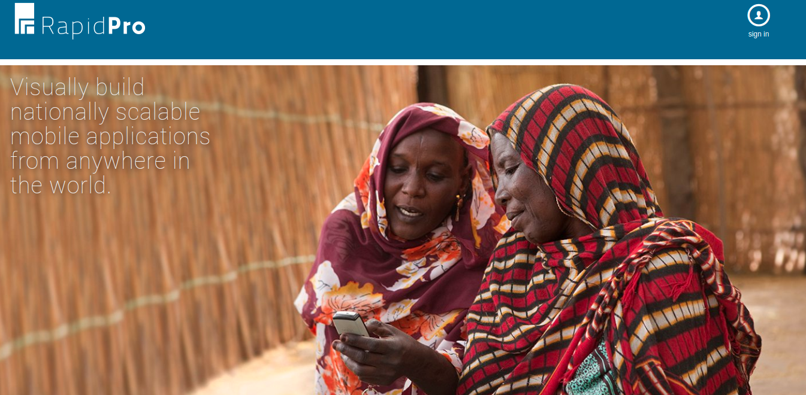

# Workshop topics

## 1. RapidPro Overview

RapidPro is a platform to build and administrate chatting actions across multiple channels.

Reference [document](https://docs.ilhasoft.mobi/l/en/getting-started/platform-overview)

### Messages

### Contacts

A contact represents the link to a final user that interacted or will interact with the platform, but more than that it's capable of persisting user's data to future uses and sorting.

  - Why a contact exist? <!-- Data storage, filters, rules. -->
  - How is it created? <!-- Dynamic or manual ways and its limits. -->
  - What's important to keep in mind? <!-- Anonymity and privacy policy, data update and erase, real-time actions, types. -->

Reference [document](https://docs.ilhasoft.mobi/l/en/contacts/contacts-introduction)

### Channels

A channel is the gateway that will allow a contact to send and receive messages, text or voice, through the plataform, it is possible connect as many channels as necessary.

  - Channels Type <!-- Voice or text, native or external. -->
  - Adding a channel <!-- Quick step in. -->
  - Administrating a channel <!-- Graphics, logs and editing. -->

Reference [document](https://docs.ilhasoft.mobi/l/en/channels-category/channels-introduction)

### Introduction to flows (actionsets/rulesets)

Flow is the logical condition's tree visual representation that applies to active contacts. When the contact is in a flow, the interaction is direct with each action created one step at a time. The steps are composed of Actions, Rules and determine the flow length.
The complexity of a flow is directly connected to its goal and the ability to explore the platform's features.

  - Creating
  - Editing
  - Testing

Reference [document](https://docs.ilhasoft.mobi/l/en/flows-category/flow-article)

### Flow results and exports

When contacts interact with a flow, their answers will be stored as flow's result.

  - Runs
  - Analyzing
  - Exporting

Reference [document](https://docs.ilhasoft.mobi/l/en/flows-category/visualizing-and-exporting-variables)

### Triggers

Triggers allow the user to start flows based on user actions or schedules. There are different types of triggers and some of them just will be available when a compatible channel is added to the workspace.
The most common is a keyword. It works when a word is set to be the first message's word or the only one.

  - Creating
  - Editing
  - Types

Reference [document](https://docs.ilhasoft.mobi/l/en/triggers-category/introduction-to-triggers)

<!--### Maps

  - Setting the workspace's map
  - Maps availability
-->
### Workspace settings

  - Credits
  - Timezone
  - Region and maps
  - Accounts
  - Translations
  - Default email
  - API token

## 2. Contact's advanced features

### Contact types

  - Active
  - Stopped
  - Blocked

### Contact's field types

   - Classifying contact's field types
   - Using the right expressions to values correctly
   - Administrating

### Contact's field search

   - Searching for saved data
   - Using expressions

### Contact's groups

   - Static
   - Dynamic

## 3. Channel's advanced features

### Channels's specific requirements

   - Infrastructure
   - Policies
   - Permissions
   - Evaluation processes

### Roadmap for new channels

   - [Telegram](https://docs.ilhasoft.mobi/l/en/channels-category/telegram-channel)
   - [Facebook](https://docs.ilhasoft.mobi/l/en/channels-category/facebook-channel)
   - [Viber](https://docs.ilhasoft.mobi/l/en/channels-category/adding-a-viber-channel)
   - [Whatsapp](https://docs.google.com/forms/d/1KdUFmtgeuPADVUVvIdQkIpI_KSlWI4kU9925yf-DBto/edit)

<!--## Hands on - day one

  - Accessing a workspace
  - Workspace setup
  - Creating a flow
  - Adding a channel
  - Updating contacts
  - Grouping contacts
  - Setting triggers
  - Analyzing results
  - Exporting results
  - Exporting contacts
  - Exporting messages
-->
## 4. Flow's advanced features

### Flow types

   - Messaging
   - Voice
   - Surveyor

### Action sets

Actions taken on a contact.

### Rule sets

Rules applied on a contact interaction.

### Exploring webhooks

  - Calling external resources

### Expressions

  - Logical
  - System
  - Flows

## 5. Trigger's advanced features

### Trigger types and features

  - Types
  - Channel's specific

### Campaigns

  - Events
  - Requirements

## 6. Map's advanced features

### Aliases

When facing alternate spellings or names for regional locations, aliases can be used to store the proper region's name and keep a standard.

  - Adding
  - Editing
  - Administrating

### Validation

  - Validating map's available regions in a flow

## 7. U-Report

  - Admistrating
  - Important points

## 8. Upartners

  - Administrating

<!--## Hands on - day two

  - Exploring expressions and sorting options using rule and action sets.
  - Creating webhooks
  - Creating different types of triggers
  - Programming events (campaigns)
  - Exploring aliases and region's values saved
  - Adding U-Report content
  - Messaging through U-Partners
-->